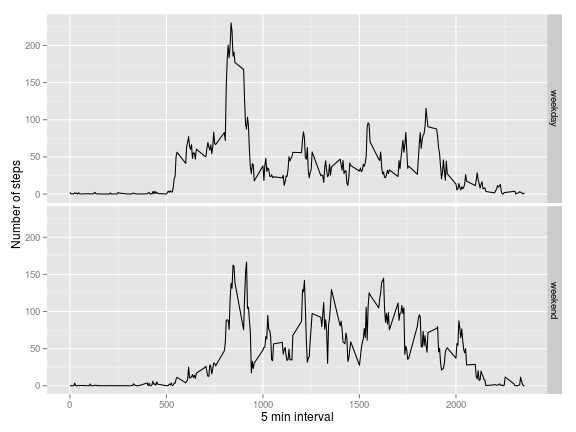

# Reproducible Research: Peer Assessment 1

=======================================================================

## Loading and preprocessing the data

```r
activity <- read.csv("activity.csv", colClasses = c("numeric", "Date", "numeric"))
```

## What is mean total number of steps taken per day?

```r
total.steps.per.day = sapply(split(activity$steps, activity$date), sum)
hist(total.steps.per.day, col = "blue", ylim = c(0, 40), 
     main = "Number of steps",
     xlab = "Total steps per day")
```

 

Calculate and report then mean and median total number of steps taken per day:

```r
print(mean(total.steps.per.day, na.rm = TRUE), digits = 7)
```

```
## [1] 10766.19
```

```r
print(median(total.steps.per.day, na.rm = TRUE), digits = 7)
```

```
## [1] 10765
```

## What is the average daily activity pattern?
A time series plot (i.e. type = "l") of the 5-minute interval (x-axis)
and the average number of steps taken, averaged across all days (y-axis)

```r
avg.steps.per.interval = sapply(split(activity$steps, activity$interval), mean, na.rm = TRUE)
plot(avg.steps.per.interval, type = "l", , xlab = "5 min interval", ylab = "Average number of steps")
```

 

On average across all the days in the dataset, the 5-minute interval contains
the maximum number of steps is

```r
avg.steps.per.interval[which.max(avg.steps.per.interval)]
```

```
##   835 
## 206.2
```

## Imputing missing values
The total number of missing values in the dataset:

```r
sum(is.na(activity$steps))
```

```
## [1] 2304
```

Replace each missing value with the mean value of its 5-minute interval

```r
activity.filler <- function(activity.data, avg.steps.per.interval) {
    for( i in 1:nrow(activity.data)){
        if (is.na(activity.data[i, "steps"])) {
            interval = as.character(activity.data[i, "interval"])
            activity.data[i, "steps"] = avg.steps.per.interval[interval]
        }
    }
    return(activity.data)
}

activity.filled <- activity.filler(activity, avg.steps.per.interval)
```
The number of missing values in the filled-in dataset

```r
sum(is.na(activity.filled$steps))
```

```
## [1] 0
```


```r
total.steps.per.day.filled = sapply(split(activity.filled$steps, activity.filled$date), sum)
hist(total.steps.per.day.filled, col = "blue", ylim = c(0, 40), 
     main = "Number of steps",
     xlab = "Total steps per day")
```

 

Calculate and report then mean and median total number of steps taken per day:

```r
print(mean(total.steps.per.day.filled, na.rm = TRUE), digits = 7)
```

```
## [1] 10766.19
```

```r
print(median(total.steps.per.day.filled, na.rm = TRUE), digits = 7)
```

```
## [1] 10766.19
```

The impact of imputing missing values:
* The mean of total number of steps per day does not differ the from the estimate from the first part.

* The median of total number of steps per day changes and is no longer an integer. The reason is that we used the average number of steps per interval, which are not always intergers, to replace missing values.

* Replacing missing values generally increases the total daily number of steps. The frequencies of some buckets in the new histogram are higher than in the old.


## Are there differences in activity patterns between weekdays and weekends?

Calculate the average number of steps per interval, group by weekday and by weekend day

```r
weekday.or.weekend <- function(activity) {
    day <- weekdays(activity)
    if (day %in% c("Monday", "Tuesday", "Wednesday", "Thursday", "Friday"))
        return("weekday")
    else if (day %in% c("Saturday", "Sunday"))
        return("weekend")
    else
        stop("invalid date")
}
activity.filled$date <- as.Date(activity.filled$date)
activity.filled$day <- sapply(activity.filled$date, FUN=weekday.or.weekend)
```
A panel plot containing plots of average number of steps taken
on weekdays and weekends.

```r
library(ggplot2)
averages <- aggregate(steps ~ interval + day, data=activity.filled, mean)
ggplot(averages, aes(interval, steps)) + geom_line() + facet_grid(day ~ .) +
    xlab("5 min interval") + ylab("Number of steps")
```

 
